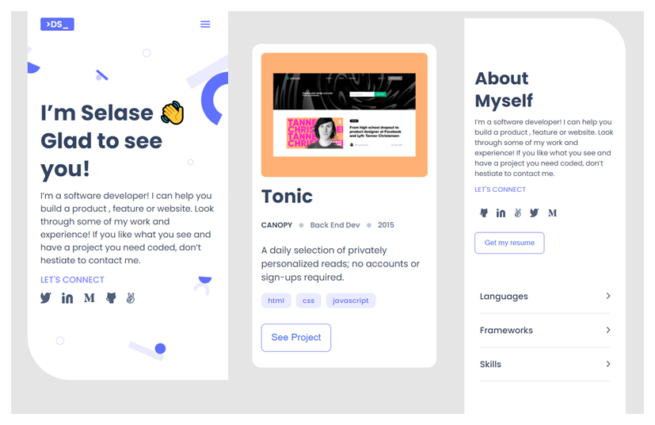

# Portfolio

> This is the complete version of my portfolio website for the Microverse curriculum. The website is optimized for desktop and mobile.

## Screenshot

## Built With

- HTML
- CSS/SCSS
- Flexbox
- CSS Grid
- Mobile-first workflow

## Live Site

🔗 [Live Site Link](https://dewslyse.github.io/Portfolio-mv/) 🚀

## Author

👤 **@dewslyse**

- GitHub: [@dewslyse](https://github.com/dewslyse)
<!-- - Twitter: [@twitterhandle](https://twitter.com/twitterhandle)
- LinkedIn: [LinkedIn](https://linkedin.com/in/linkedinhandle) -->

### Collaborator(s)

👤 **@emyrue**

- GitHub: [@emyrue](https://github.com/emyrue)

👤 **AKeeganDev**

- Github: [@AKeeganDev](https://github.com/AKeeganDev)

## 🤝 Contributing

Contributions, issues, and feature requests are welcome!

Feel free to check the [issues page](../../issues/).

## Show your support

Give a ⭐️ if you like this project!

<!-- ## Acknowledgments

- Hat tip to anyone whose code was used
- Inspiration
- etc -->

## 📝 License

This project is [MIT](https://github.com/microverseinc/readme-template/blob/master/MIT.md) licensed.
