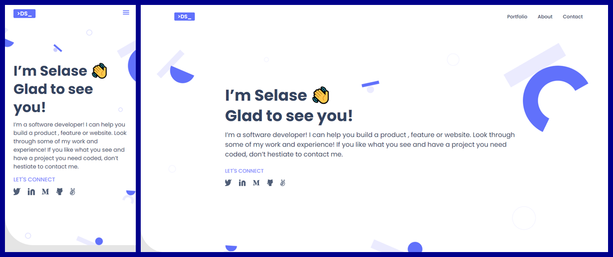

# Portfolio

> This an initial setup for the building of my website portfolio during the first module of the Microverse curriculum.

## Screenshot

## Built With

- HTML
- CSS/SCSS

<!-- ## Live Demo (if available)

[Live Demo Link](https://livedemo.com) -->

## Author

👤 **@dewslyse**

- GitHub: [@dewslyse](https://github.com/dewslyse)
<!-- - Twitter: [@twitterhandle](https://twitter.com/twitterhandle)
- LinkedIn: [LinkedIn](https://linkedin.com/in/linkedinhandle) -->

## 🤝 Contributing

Contributions, issues, and feature requests are welcome!

Feel free to check the [issues page](https://github.com/microverseinc/readme-template/issues).

## Show your support

Give a ⭐️ if you like this project!

<!-- ## Acknowledgments

- Hat tip to anyone whose code was used
- Inspiration
- etc -->

## 📝 License

This project is [MIT](https://github.com/microverseinc/readme-template/blob/master/MIT.md) licensed.
